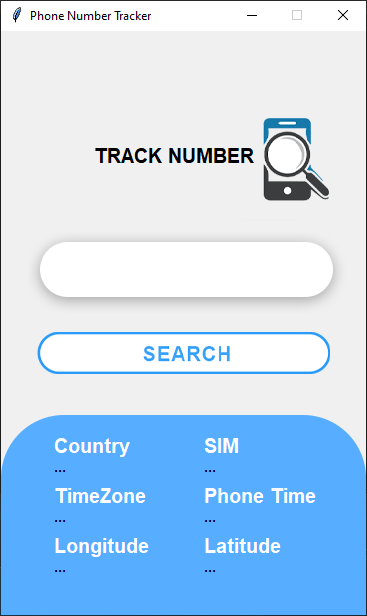

# Phone-Number-Tracker
It is simple app which can find much and more information about phone number. Just like location, time zone, country, time showing in mobile and many other things. It is a completely gui tkinter project.

<b>Required modules :-
<li>pip install pytz,
<li>pip install geopy,
<li>pip install phonenumbers,  
<li>pip install timezonefinder</li></b>   

<b>How to use this app?</b>  

<b>Step 1 :- </b>Download the Mobile Tracker.rar  
<b>Step 2 :- </b>Extract the files.  
<b>Step 3 :- </b>Run <b>Mobile_tracker.py</b> file.  
<b>Step 4 :- </b>Enter the Mobile number in search box.  
<b>Step 5 :- </b>Hit the Search button.  

<b>Preview of App :-</b>

